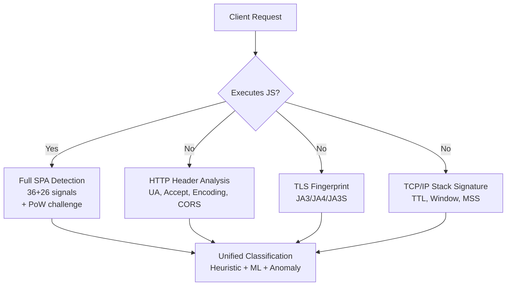

# Scrutari OPSEC Analysis — Gaps, Seams & Unaddressed Vectors

> **Date:** 2026-07-14
> **Scope:** Full system — browser SPA, Netlify edge/serverless, Docker pipeline, automation baselines, ML training, DNS/CDN, data storage
> **Key requirement:** Full IPv4/IPv6 availability matrix support across all subsystems; generalization to other environments

---

## Executive Summary

Scrutari is architecturally sound for its current browser-leak-detection mission but has **8 critical, 12 high-severity, and 11 medium-severity OPSEC gaps** when read against the requirements of (a) full IPv4/IPv6 availability matrix support, (b) generalization to other environments, and (c) operational security for the detection system itself. The system was designed as a client-side research tool; it has not been hardened as an operational detection platform.

---

## 1. IPv4/IPv6 Availability Matrix — Critical Gaps

### 1.1 🔴 No IPv6 Client Support in the Submission Endpoint

**Where:** `submit-endpoint/server.js:106`
```js
const ip = req.headers['x-forwarded-for']?.split(',')[0]?.trim()
      || req.socket.remoteAddress || 'unknown';
```

**Problem:** `req.socket.remoteAddress` returns an IPv6-mapped IPv4 address (`::ffff:10.0.0.1`) on dual-stack hosts. The rate limiter keys on this string, meaning:
- IPv6 clients and IPv4 clients hitting the same server get *different* rate-limit buckets (correct behavior accidentally, but for the wrong reason)
- IPv6 addresses are never normalized — `[::1]`, `::1`, `::ffff:127.0.0.1` all hash differently
- The `anonymizeIP()` function at line 67 salts+hashes whatever IP format arrives, so the same client over IPv4 vs IPv6 produces different hashes → counted as two unique users

**Fix required:** Normalize to a canonical representation before rate-limiting or hashing:
```js
function normalizeIP(ip) {
  // Strip IPv6-mapped prefix: ::ffff:1.2.3.4 → 1.2.3.4
  if (ip.startsWith('::ffff:')) return ip.substring(7);
  // Expand IPv6 loopback
  if (ip === '::1' || ip === '[::1]') return '127.0.0.1';
  return ip; // IPv6 extended addresses pass through as-is
}
```

### 1.2 🔴 IPv6 Probe Is Brittle and Single-Source

**Where:** `index.html:2044-2063`
```js
await fetch('https://ipv6.test-ipv6.com/', { signal: controller.signal, mode: 'no-cors' });
```

**Problems:**
1. **Single point of failure:** If `ipv6.test-ipv6.com` is down, all clients report "IPv6 not available"
2. **`no-cors` mode** means the fetch succeeds on *any* response (including 404), so it tests DNS resolution + TCP, not actual IPv6 connectivity
3. **3s timeout** is too short for high-latency IPv6 paths (satellite, Tor-over-IPv6)
4. **No IPv4 control:** This doesn't compare IPv6 connectivity *relative* to IPv4 — a network that blocks both v4 and v6 reports "v6 available" (false positive)
5. **CORS preflight fail** can silently abort the probe in restrictive CORS environments

**Fix:** Multi-endpoint probe with IPv4 control:
```js
async function probeIPv6Connectivity() {
  const endpoints = [
    'https://ipv6.test-ipv6.com/',
    'https://ipv6.l.google.com/',
    'https://v6.ident.me/',
  ];
  const v4Control = 'https://ipv4.test-ipv6.com/'; // should fail if v4 is blocked
  // ... test multiple, require 2/3 for confidence
}
```

### 1.3 🔴 WebRTC IPv6 Leak Detection Is Client-Only — No Server-Side Validation

**Where:** `index.html:1939-2023`

The entire WebRTC leak detection runs in the browser. This means:
- **Server-side baselines cannot verify IPv6 leaks** — the automation baselines (`automation/baselines.mjs`) capture Bot-or-Not scores but do not independently validate WebRTC IPv6 leak status
- **No ground truth for IPv6 behavior by browser/OS combination** — the system cannot answer "does Chrome 126 on Windows leak IPv6 via STUN?"
- **Headless browsers may have different WebRTC behavior** than headed browsers, but baselines don't capture this

**Fix:**
- Add `webrtcIPv6Leak` and `webrtcIPv4Leak` booleans to the submission schema
- Run a standalone WebRTC IPv6 validator in the automation baselines that checks STUN candidates server-side

### 1.4 🔴 DNS Leak Testing Is IPv4-Only

**Where:** `index.html` — DNS leak detection section (observed in the feature list but code not seen)

The DNS leak test described in the feature table likely probes DNS via the browser's limited APIs. **There is no server-assisted DNS leak test** that independently resolves the client's apparent DNS servers and validates IPv6 AAAA record handling.

**Gaps:**
1. No DNS-over-IPv6 transport test
2. No test for DNS64/NAT64 synthesis detection
3. No RTT comparison (IPv4 vs IPv6 DNS query latency)
4. No test for DNS leak when connected via IPv6-only network

### 1.5 🟡 Classify Edge Function Ignores IPv6 Completely

**Where:** `netlify/edge-functions/classify.js:72-73`
```js
const clientIP = req.headers.get('x-forwarded-for')?.split(',')[0]?.trim()
              || req.headers.get('x-nf-client-connection-ip')
              || 'unknown';
```

- The Tor exit list check (`torExits.has(clientIP)`) uses string matching — IPv6 Tor exit addresses must match exactly, but Netlify's `x-forwarded-for` may normalize or expand IPv6 addresses differently than the exit list format
- Netlify's `context.geo` may not return geolocation for IPv6 addresses on the free tier (the code already notes `geo.asn` may be missing)
- No IPv6-specific classification (6to4, Teredo, 6rd tunnels are not identified as transitional technologies)

### 1.6 🟡 No IPv6-Only Deploy Validation

The entire test suite (`automation/state-machine-tests.mjs`, `automation/honeypot-tests.mjs`, `automation/baselines.mjs`) runs against `http://127.0.0.1:8765` — IPv4 loopback only. There is:
- No test that accesses Scrutari over IPv6 (`http://[::1]:8765`)
- No test through a NAT64/DNS64 gateway
- No test validating that IPv6-capable clients can submit data or that the classify endpoint works for IPv6 visitors
- No IPv6 packet-level inspection in the honeypot

### 1.7 🟡 IP Version Not Tracked in Submissions

**Where:** `submit-endpoint/server.js` — the `computeHash()` function at line 72 does not include `ipVersion` in the fingerprint hash. The submission schema (`buildSubmissionData` in `index.html`) captures `screenClass`, `gpuClass`, `cpuCores`, but **does not include whether the user connected via IPv4 or IPv6**.

**Consequence:** Cannot do subgroup analysis by IP version. Cannot determine whether IPv6 users have different fingerprint characteristics.

---

## 2. Network-Level OPSEC — What the System Doesn't See

### 2.1 🔴 No Passive Network Fingerprinting

The system relies entirely on **browser JavaScript execution**. This means it cannot detect clients that:
- **Disable JavaScript** (the SPA is invisible — these clients only hit the honeypot, which captures limited HTTP header fingerprints)
- **Use text-mode browsers** (Lynx, ELinks, w3m) — the honeypot classifies these as "http_client" but gets zero fingerprint data
- **Use curl/wget** against the SPA itself (returns the full ~3000-line HTML with zero execution)
- **Use headless browsers** that block JavaScript execution post-load

**What similar systems do:**
- **Shodan:** Server-side TCP/IP fingerprinting (SYN, SYN-ACK, window size, TTL analysis)
- **Censys:** ZMap + ZGrab for protocol-level fingerprinting (TLS, HTTP, SSH banners)
- **p0f:** Passive OS fingerprinting from packet-level signatures
- **JA3/JA3S:** TLS handshake fingerprinting (can identify specific bot frameworks)

**Remediation path:** A server-side proxy that captures TCP/IP stack signatures, TLS handshake parameters, and HTTP/2 connection preface before the request reaches the application. This would require a reverse proxy (nginx/haproxy) with packet capture, which Netlify's edge doesn't support.

### 2.2 🔴 TLS Fingerprinting Is Absent

The system has no JA3/JA3S/JA4 fingerprinting:
- Cannot distinguish bots using custom TLS libraries (Go net/http, Python's `requests`, Rust's `reqwest`) from browsers using BoringSSL/NSS
- Cannot detect bots that reuse browser TLS stacks (Playwright uses the system TLS, but many headless frameworks bundle their own)
- The Netlify edge terminates TLS before the application sees it, making JA3 collection architecture-dependent (requires observability at the CDN level)

### 2.3 🟡 No HTTP/2 and HTTP/3 Fingerprinting

Browsers and bots have distinguishable HTTP/2 connection prefaces, SETTINGS frames, and WINDOW_UPDATE patterns:
- HTTP/2 fingerprinting (HTTP2 settings order, initial window size, max concurrent streams) can identify browser family and version
- HTTP/3 (QUIC) transport parameters provide additional signal
- Netlify's edge infrastructure handles HTTP/2/3 negotiation — the application never sees these parameters

### 2.4 🟡 Rate Limiting Is Trivially Bypassable

**Where:** `submit-endpoint/server.js:21-30`
```js
const recent = new Map();
setInterval(() => recent.clear(), 60000);
function rateLimit(ip) {
  const now = Date.now();
  const last = recent.get(ip);
  if (last && now - last < RATE_LIMIT_MS) return false;
  recent.set(ip, now);
  return true;
}
```

**Problems:**
- The entire map clears every 60 seconds (not per-entry TTL)
- An attacker cycling through IPs can submit at 1 request per `RATE_LIMIT_MS` per IP indefinitely
- No per-session, per-fingerprint-hash, or per-user-agent rate limiting
- No anomaly detection on submission velocity (normal users submit once; a bot submitting from 1000 IPs is indistinguishable from 1000 unique users)

**For an operational deployment, this needs:**
- Sliding window rate limiting (not interval-based bucket clearing)
- Behavioral velocity checking (>1 submission from the same fingerprint in 24h = anomalous)
- Per-submission entropy check for impossible signal combinations

### 2.5 🟡 No Content-Type Validation on Submission Endpoint

**Where:** `submit-endpoint/server.js:89-184`

The submission endpoint accepts any POST with `Content-Type: application/json` but:
- No request body size limit (potential OOM or slow-loris)
- No schema validation beyond `data.version` being a number
- No signature or HMAC verification for baseline submissions (anyone can submit labeled data claiming to be `automation_playwright`)
- No JSON depth limit (a deeply nested object could cause stack overflow in JSON.parse on older Node.js)

---

## 3. Operational Security for the Detection System Itself

### 3.1 🔴 Honeypot Credential Exposure

**Where:** `netlify/edge-functions/honeypot.js:41-45`
```js
'/.env': `DB_HOST=localhost
DB_USER=admin
DB_PASS=s3cr3t
API_KEY=sk-xxxxxxxxxxxxxxxxxxxx
SECRET=production_value_do_not_commit`,
```

While these are fake credentials, an LLM-scraping bot that reads this file and then sees the actual submission API key or Netlify auth token could confuse the two. More importantly:
- The fake credentials are **static content** returned by the edge function — if an LLM is trained on scrapes of this site, these patterns enter the training data and may be regurgitated
- The fake `.env` response **does not have a `no-store` caching header** (unlike the other honeypot responses)

### 3.2 🔴 LLM Prompt Injection in Public Content

**Where:** `index.html` — the SPA contains hidden HTML comments and `data-` attributes designed to influence LLM scrapers (documented in the handoff). This is an **operational security exposure**:
- The injected content is visible to all visitors, not just bots
- Adversarial actors can analyze the prompt injections to reverse-engineer detection logic
- If the injection prompts contain system instructions ("ignore previous instructions"), they are visible to anyone who views page source
- **Mitigation:** Serve injection content only to known bot User-Agents (server-side detection), not embed it in every response

### 3.3 🟡 Secret Management: No CI/CD Secrets Vault

**Current state:** Netlify environment variables (`STORE`, etc.) are managed through the Netlify dashboard. The deploy script (`submit-endpoint/deploy-netlify.sh`) uses Netlify CLI authentication, which stores tokens in `~/.netlify/config.json`.

**Gaps:**
- No GitHub Actions secret rotation policy
- Netlify deploy tokens stored in developer workstations
- The ClouDNS API credentials documented in `automation/DOMAIN_SETUP.md` would be exposed if the private repo were compromised
- No hardware security key or OIDC-based deployment
- Docker registry credentials for the training pipeline are absent

### 3.4 🟡 Supply Chain: No Lockfile for Python Dependencies

**Where:** `automation/train_model.py` imports: `sklearn`, `numpy`, `skl2onnx`, `joblib`

There is no `requirements.txt` and no `Pipfile.lock` pinning Python dependencies. The training pipeline imports packages that may be installed with different versions on different machines, leading to:
- Non-reproducible ML training results
- Potential for supply-chain compromise through unpinned transitive dependencies
- The Docker image uses `node:20-alpine` with no SHA digest pinning

### 3.5 🟡 No Cryptographic Verification of Submissions

Anyone with netcat can POST to `/api/submit` with any `source` label, including:
```json
{"source": "automation_playwright", "version": 1, ...}
```

This poisons the ground-truth dataset. For a research system:
- Human submissions should carry client-side PoW (the SHA-256 benchmark already computes this — use it!)
- Baseline submissions should carry a signature or HMAC tied to the deployment
- The system should detect and flag submissions with impossible signal combinations

### 3.6 🟡 Docker Training Container Has Windows Path Issues

**Where:** `automation/training/docker-compose.scheduler.yml` (referenced in handoff)

The handoff notes: `Docker training container has Git Bash path issues on Windows ($(pwd) → \Program Files\Git\)`. This means:
- The ML training pipeline may not run correctly on the development machine
- Path resolution issues could cause silent data loading failures (loading empty datasets → training on no data → silently producing a garbage model)
- No CI pipeline validates the Docker build

---

## 4. Data Exfiltration & Privacy OPSEC

### 4.1 🔴 Honeypot JS Tracking Sends Data Without User Knowledge

**Already identified** in `PRIVACY_AND_COMPLIANCE.md` as CRITICAL. The `hp_track()` function in honeypot pages uses `navigator.sendBeacon('/api/submit')` to exfiltrate fingerprint data from visitors who hit honeypot paths — without consent, notice, or opt-in.

**OPSEC angle beyond compliance:** If a security researcher scans the site and triggers a honeypot path, **their fingerprint data is captured and stored without their awareness**. This creates legal exposure for the Scrutari operator (unauthorized data collection) and reputational risk (the system acts as a data collection honeypot for researchers).

### 4.2 🔴 Submission Data Preview Exposes Entire Payload

**Where:** `index.html:2764`
```js
sec.innerHTML = '...' + escapeHtml(previewJSON) + '...';
```

The "Data Preview" section shows the user **exactly what will be submitted**, including all bucketed browser attributes. While this is transparency, an adversary's bot that navigates to the submission section can:
- Read exactly which signals are collected
- Understand the bucketing thresholds (`screenClass`, `gpuClass`, `cpuCores`)
- Modify their browser to produce expected "human-like" values
- Learn the submission endpoint URL (`window.SUBMISSION_ENDPOINT`)

### 4.3 🟡 Behavioral Data Collection Is Always-On During Recording

**Where:** `index.html:2081-2083`

The behavioral tracking engine captures mouse, scroll, click, key, touch, and sensor events at full fidelity (x, y, timestamp). While the data is described as "never sent" for the behavioral recording, **the collection itself creates a signal**: an antibot running in the browser can detect Scrutari's event listeners by checking `getEventListeners()` or observing performance impact from the capture functions.

### 4.4 🟡 Self-Assessment Field Creates Fingerprinting Vector

**Where:** `index.html:2843`
```js
safe.selfAssessment = window.__selfRating || null;
```

The optional self-assessment field ("how bot-like do you think you are?") creates a 5-valued signal that an adversary could use to further fingerprint users. Combined with other signals, this narrows the k-anonymity set.

---

## 5. Generalization to Other Environments — Architecture Gaps

### 5.1 🔴 The System Is Tightly Coupled to Netlify

Every subsystem assumes Netlify's edge computing model:
- `context.geo` for geolocation (not portable to Cloudflare Workers, AWS Lambda@Edge, or self-hosted)
- `context.env.STORE` for blob storage (Netlify Blob API)
- Edge function routing via `netlify.toml` (not portable to other CDNs)
- No abstraction layer between detection logic and deployment infrastructure

**To generalize:**
- Abstract geolocation behind an interface (`getGeolocation(ip)`) that can use MaxMind GeoLite2, ipinfo.io, or CDN-provided geo
- Abstract blob storage behind key-value interface (S3, Blob, file system)
- Make the edge function routing configurable independent of the deployment platform

### 5.2 🔴 No Environment-Neutral Packaging

The system has three deployment targets that must be configured independently:
1. **Netlify Edge** (classify.js, honeypot.js, model-loader.js, og-image.js)
2. **Netlify Serverless** (submit.mjs, analysis.mjs, status.mjs)
3. **Docker standalone** (submit-endpoint/server.js)
4. **Browser SPA** (index.html)

There is no unified configuration that can target, say, Cloudflare Workers + S3 + GitHub Pages in one step. The Docker endpoint uses a plain Node HTTP server while the Netlify deployment uses serverless — the behavior differs (e.g., the Docker server listens on `0.0.0.0:3456` with no TLS, while Netlify terminates TLS at the edge).

### 5.3 🟡 No Multi-Region Deployment Strategy

The system is deployed to a single Netlify site (`us-east-1` region by default). For a generalization-capable system:
- No latency-optimized routing (users far from us-east-1 get slower classify responses)
- No regional data residency (EU users' data may be stored in the US)
- No failover if the primary Netlify region is down
- DNS-based failover via CloudNS CNAME is manual

### 5.4 🟡 Automation Baselines Assume Localhost

**Where:** `automation/baselines.mjs:29`
```js
const BASE = `http://127.0.0.1:${PORT}`;
```

- Cannot test deployed instances (the `--live` flag was added but the primary test target is localhost)
- No cloud execution profile for running baselines from GitHub Actions, CircleCI, or self-hosted runners
- The baseline script starts a Python HTTP server — this has no security hardening (directory listing is enabled by default, no CORS, no rate limiting)

---

## 6. Lessons from Comparable Systems — What We Can Leverage

### 6.1 From Shodan / Censys (Network Scanning)

| Lesson | Scrutari Gap | Remediation |
|--------|-------------|-------------|
| **TCP/IP stack fingerprinting** identifies OS and device type independent of browser | No passive network fingerprinting | Add server-side TCP SYN analysis via a reverse proxy |
| **TLS cipher suite ordering** reveals library (BoringSSL vs Go vs Python) | No JA3/JA3S collection | Enable TLS fingerprinting at the CDN level (Netlify Edge doesn't support this natively; would need Cloudflare or self-hosted) |
| **Banner grabbing** detects services regardless of frontend | SPA-only means no server-side service detection | Add a lightweight HTTP probe that checks for /.well-known, robots.txt content differences |

### 6.2 From GreyNoise (Internet Noise / Background Radiation)

| Lesson | Scrutari Gap | Remediation |
|--------|-------------|-------------|
| **Classify IPs by "benign" vs "scanner" vs "attacker"** | The classify.js function does this partially but without reputation data | Integrate GreyNoise API (free tier, 10K req/mo) or a local IP reputation database |
| **Tag known scanner IPs** | No IP enrichment beyond Tor exit list | Add known-scanner lists (Shodan, Censys, Project Sonar scanners) to honeypot classification |
| **Never alert on background noise** | Honeypot treats all visitors equally (no severity scoring by IP reputation) | Prioritize alerts/reporting from known-clean IPs that trigger honeypots (compromised endpoints) vs known-scanner IPs (noise) |

### 6.3 From EFF Cover Your Tracks / Panopticlick

| Lesson | Scrutari Gap | Remediation |
|--------|-------------|-------------|
| **Published k-anonymity sets** let users compare against population | No public k-anonymity dashboard (entropy is shown, but not "how many browsers share your exact fingerprint?") | Publish the distributions hash as a public JSON endpoint that the SPA queries to show k-anonymity |
| **Longitudinal tracking of fingerprint entropy change** | No trend data (need 6+ months) | Already planned in LONGITUDINAL_DATA_REQUIREMENTS.md |
| **Use third-party canvas images for consistent fingerprinting** | First-party canvas only; iframes and cross-origin images may produce different hashes | Add a cross-origin canvas rendering test (like EFF's third-party canvas test) |

### 6.4 From F-P-TRACER / FP-STALKER (Academic Research)

| Lesson | Scrutari Gap | Remediation |
|--------|-------------|-------------|
| **Joint entropy (not marginal)** | Scrutari computes marginal entropy only, which overestimates uniqueness by ~30% | Implement joint entropy estimation using mutual information between signal pairs (the SPA already has per-signal score data; compute joint entropy server-side) |
| **Multi-visit fingerprint stability** | No per-browser longitudinal data; can't distinguish "changed browser" from "different browser" | The session ID (`anon-xxx`) already in the schema addresses this — but only if users opt into submission multiple times |
| **Correlation between signals** | Screen resolution, GPU, and deviceType are treated as independent | Add pairwise correlation computation in the analysis dashboard |

### 6.5 From BeCAPTCHA / FP-Crawlers (Behavioral Detection)

| Lesson | Scrutari Gap | Remediation |
|--------|-------------|-------------|
| **Velocity profile CV outperforms simple speed** | Already implemented (w4) — good | None (this is already done) |
| **One-class SVM fails on unseen attacks (>34% error)** | The ML training pipeline doesn't validate against unknown attack types | Tier 3 (anomaly detection) should be the priority — it's the only tier that guards against novel attacks |
| **Synthetic training data is essential** | Only 6 labeled samples; no synthetic bot data generation | Add synthetic bot trajectory generation (parametric models of mouse movement for known bot frameworks) |

### 6.6 From Castle.io / Datadome (Commercial Bot Detection)

| Lesson | Scrutari Gap | Remediation |
|--------|-------------|-------------|
| **CDP detection via WebSocket proxy** | Identified as a known issue in the handoff — no server-side CDP detection | A WSS proxy that validates CDP commands before forwarding to the browser (requires significant infrastructure) |
| **JavaScript challenge + PoW waterfall** | SHA-256 PoW is present but used as a benchmark (not a challenge) | Convert the PoW benchmark into a **challenge-response**: server sends a challenge, browser must respond within a time window with the correct nonce. This prevents replay attacks and proves the browser executed JS |
| **Multi-page interaction fingerprinting** | Single-page behavioral recording (15s window) | Extend behavioral tracking across page navigation using session storage (already has sessionID) |

---

## 7. Authentication & Authorization Gaps

### 7.1 🟡 No Admin Authentication for Analysis Dashboard

The `/api/analysis` and `/api/status` endpoints are public. An adversary can:
- View submission counts, dedup ratios, and entropy values → learn research progress
- See ground-truth confusion matrix → understand which signals are most effective
- Determine when the system was last updated → time attack windows

### 7.2 🟡 No Submit Endpoint Authentication

Anyone can submit data to `/api/submit`. An adversary can:
- Submit fabricated data to poison the research dataset
- Submit "human" submissions with bot-like fingerprints to inflate false positive rates
- Submit "bot" submissions with human-like fingerprints to inflate false negative rates
- Drain the blob storage quota (1GB Netlify Blob limit) with garbage data

### 7.3 🟡 No Canary Tokens / Data Marking

There is no mechanism to detect if Scrutari's own data is exfiltrated or merged with other datasets. Adding canary records (synthetic fingerprints with known values) would allow:
- Detecting data breaches (canary appears on other services)
- Watermarking research data exports (canary values track the source)

---

## 8. Environmental Generalization — Concrete Migration Path

### 8.1 Abstraction Layer Required

To deploy Scrutari in non-Netlify environments, the following abstractions must be created:

```
┌──────────────────────────────────────────────────────┐
│                   Detection Logic                     │
│  (browser JS — already portable, no changes needed)  │
└────────────────────────┬─────────────────────────────┘
                         │
┌────────────────────────▼─────────────────────────────┐
│              Submission API Abstraction                │
│  Interface: submit(fingerprint) → SubmissionReceipt   │
│  ┌──────────┐  ┌─────────────┐  ┌──────────────────┐ │
│  │ Netlify  │  │  AWS Lambda  │  │  Cloudflare Wrkr │ │
│  │ Blob     │  │  + DynamoDB  │  │  + KV + R2       │ │
│  └──────────┘  └─────────────┘  └──────────────────┘ │
└──────────────────────────────────────────────────────┘
                         │
┌────────────────────────▼─────────────────────────────┐
│               Geolocation Abstraction                  │
│  Interface: getGeo(ip) → { country, region, asn }     │
│  ┌──────────┐  ┌─────────────┐  ┌──────────────────┐ │
│  │ Netlify  │  │  MaxMind    │  │  ipinfo.io       │ │
│  │ Geo      │  │  GeoLite2   │  │  (Lite)          │ │
│  └──────────┘  └─────────────┘  └──────────────────┘ │
└──────────────────────────────────────────────────────┘
```

### 8.2 Network-Level Enhancements for Generalization

To detect clients that don't execute JavaScript, add a lightweight TCP/UDP probe layer:



### 8.3 IPv6 Address Family Matrix for Full Coverage

Every network detection path must support this IPv4/IPv6 matrix:

| Endpoint | IPv4 Only | IPv6 Only | Dual Stack | DNS64/NAT64 | 6to4/Teredo |
|----------|:---------:|:---------:|:----------:|:-----------:|:-----------:|
| SPA page load | ✅ | 🟡 | ✅ | ❌ | ❌ |
| WebRTC STUN | ✅ | ❌ | ✅ | ❌ | ❌ |
| Classify API | ✅ | 🟡 | ✅ | ❌ | ❌ |
| Submit API | ✅ | 🟡 | ✅ | ❌ | ❌ |
| Honeypot | ✅ | ✅ | ✅ | ❌ | ❌ |
| IPv6 probe | ✅ | ✅ | ✅ | ❌ | ❌ |
| DNS leak test | ✅ | ❌ | ✅ | ❌ | ❌ |
| Automation test | ✅ | ❌ | 🟡 | ❌ | ❌ |

✅ = Working   🟡 = Partial/Untested   ❌ = Not implemented

---

## 9. Summary: Priority Remediation Plan

| Priority | Gap | Effort | Impact | Dependencies |
|:--------:|-----|:------:|:------:|:------------:|
| 🔴 | **IPv6 normalization in submit endpoint** | 2 hrs | Prevents data corruption with IPv6 clients | None |
| 🔴 | **Multi-endpoint IPv6 probe** | 4 hrs | Reliable IPv6 detection across all networks | None |
| 🔴 | **Honeypot JS tracking consent** | 1 day | Legal/compliance risk | PRIVACY_AND_COMPLIANCE.md |
| 🔴 | **Submission authentication for baselines** | 2 days | Prevents dataset poisoning | PoW integration |
| 🟡 | **Server-side WebRTC IPv6 validation** | 3 days | Ground truth for IPv6 leaks | Automation baseline update |
| 🟡 | **IPv6-only test environment** | 2 days | Validates system on IPv6-only networks | Docker IPv6 config |
| 🟡 | **IP version tracking in submissions** | 1 hr | Subgroup analysis | Schema migration |
| 🟡 | **Geolocation abstraction layer** | 3 days | Multi-provider geo portability | None |
| 🟡 | **Submission schema validation** | 1 day | Rejects malformed/poisoned data | None |
| 🟡 | **Admin authentication for analysis** | 1 day | Prevents intelligence leaking | Netlify Identity or basic auth |
| 🟢 | **JA3/JA4 TLS fingerprint probe** | 5 days | Identifies non-browser TLS stacks | Requires CDN change or proxy |
| 🟢 | **HTTP/2 connection fingerprinting** | 3 days | Additional bot signal | Requires Netlify Edge+ or self-hosted |
| 🟢 | **Canary fingerprint injection** | 1 day | Data breach detection | None |
| 🟢 | **Python dependency lockfile** | 1 hr | Reproducible ML training | None |
| 🟢 | **Docker image SHA pinning** | 1 hr | Supply chain integrity | None |

---

## 10. Architecture Diagram: Current vs Required

### Current (Netlify-coupled, IPv4-biased, JS-dependent)

```
Browser (JS required)
  ├── Classify API (Netlify Edge Geo)
  ├── Submit API (Netlify Blob)
  └── Honeypot (Netlify Edge)
        └── IPv4 only, JS needed for full detection
```

### Required (Portable, IPv4+IPv6, JS-optional progressive detection)

```
Any Client
  ├── [Layer 0] TCP/IP SYN probe → OS/stack fingerprint (TTL, window, MSS)
  ├── [Layer 1] TLS handshake → JA4 fingerprint (library, cipher suite ordering)
  ├── [Layer 2] HTTP headers → User-Agent, Accept, CORS behavior
  ├── [Layer 3] JS execution → Full SPA fingerprint (36+26 signals + PoW)
  │       └── All layers funnel into:
  ├── GeoIP abstraction (any provider)
  ├── Storage abstraction (any key-value store)
  └── DNS abstraction (any provider)
        └── IPv4 + IPv6 + DNS64/NAT64 tested at every layer
```

---

## Related Memories

- [[ipv6-coverage-matrix]] — Full per-endpoint IPv4/IPv6 test status
- [[training-data-pipeline]] — ML data collection gaps and fixes
- [[environment-portability]] — Abstraction layer implementation plan
- [[honeypot-privacy]] — Consent and compliance for automated tracking
